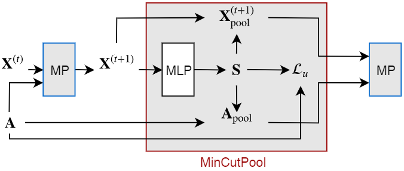
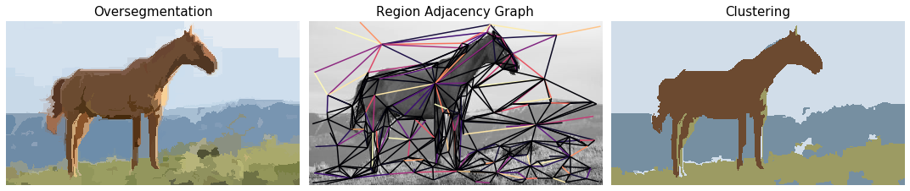
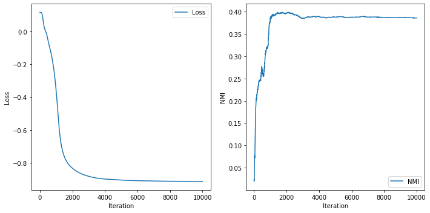
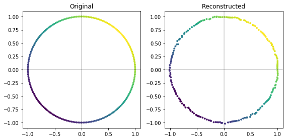
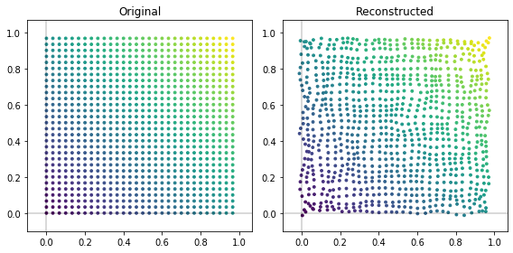

# Spectral Clustering with Graph Neural Networks for Graph Pooling



This code reproduces the experimental results obtained with the MinCutPool layer 
as presented in the ICML 2020 paper 

[Spectral Clustering with Graph Neural Networks for Graph Pooling](https://arxiv.org/pdf/1907.00481.pdf)  
F. M. Bianchi*, D. Grattarola*, C. Alippi

The official implementation of the MinCutPool layer can be found in 
[Spektral](https://graphneural.network/layers/pooling/#mincutpool). 

An implementation of MinCutPool for PyTorch is also available in 
[Pytorch Geometric](https://pytorch-geometric.readthedocs.io/en/latest/modules/nn.html#torch_geometric.nn.dense.mincut_pool.dense_mincut_pool).

## Setup

The code is based on Python 3.5, TensorFlow 1.15, and Spektral 0.1.2. 
All required libraries are listed in `requirements.txt` and can be installed with

```bash
pip install -r requirements.txt
``` 

## Image segmentation



Run [Segmentation.py](https://github.com/FilippoMB/Spectral-Clustering-with-Graph-Neural-Networks-for-Graph-Pooling/blob/master/Segmentation.py) 
to perform hyper-segmentation, generate a Region Adjacency Graph from the 
resulting segments, and then cluster the nodes of the RAG graph with the 
MinCutPool layer.

## Clustering



Run [Clustering.py](https://github.com/FilippoMB/Spectral-Clustering-with-Graph-Neural-Networks-for-Graph-Pooling/blob/master/Clustering.py) 
to cluster the nodes of a citation network. The datasets `cora`, `citeseer`, and 
`pubmed` can be selected.
Results are provided in terms of homogeneity score, completeness score, and 
normalized mutual information (v-score).

## Autoencoder




Run [Autoencoder.py](https://github.com/FilippoMB/Spectral-Clustering-with-Graph-Neural-Networks-for-Graph-Pooling/blob/master/Autoencoder.py) 
to train an autoencoder with bottleneck and compute the reconstructed graph. It 
is possible to switch between the `ring` and `grid` graphs, but also any other 
[point clouds](https://pygsp.readthedocs.io/en/stable/reference/graphs.html?highlight=bunny#graph-models) 
from the [PyGSP](https://pygsp.readthedocs.io/en/stable/index.html) library 
are supported. Results are provided in terms of the Mean Squared Error.

## Graph Classification

Run [Graph_Classification.py](https://github.com/FilippoMB/Spectral-Clustering-with-Graph-Neural-Networks-for-Graph-Pooling/blob/master/Graph_Classification.py) to train a graph classifier. Additional classification datasets are available [here](https://chrsmrrs.github.io/datasets/) (drop them in ````data/classification/````) and [here](https://github.com/FilippoMB/Benchmark_dataset_for_graph_classification) (drop them in ````data/````).
Results are provided in terms of classification accuracy averaged over 10 runs.

## Citation

Please, cite the original paper if you are using MinCutPool in your research

	@inproceedings{bianchi2020mincutpool,
        title={Spectral Clustering with Graph Neural Networks for Graph Pooling},
        author={Bianchi, Filippo Maria and Grattarola, Daniele and Alippi, Cesare},
        booktitle={Proceedings of the 37th international conference on Machine learning},
        pages={2729-2738},
        year={2020},
        organization={ACM}
    }
    
## License

The code is released under the MIT License. See the attached LICENSE file.
